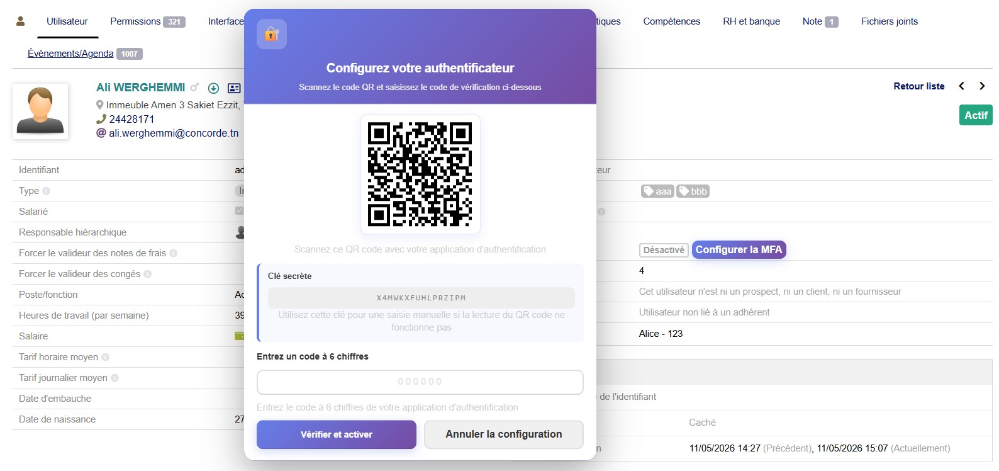
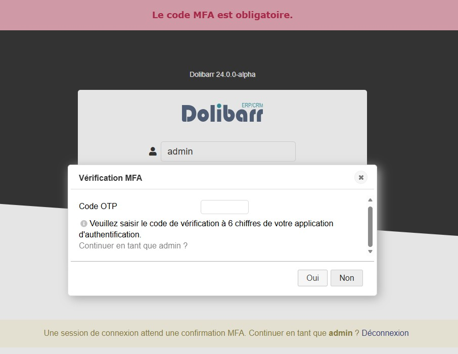
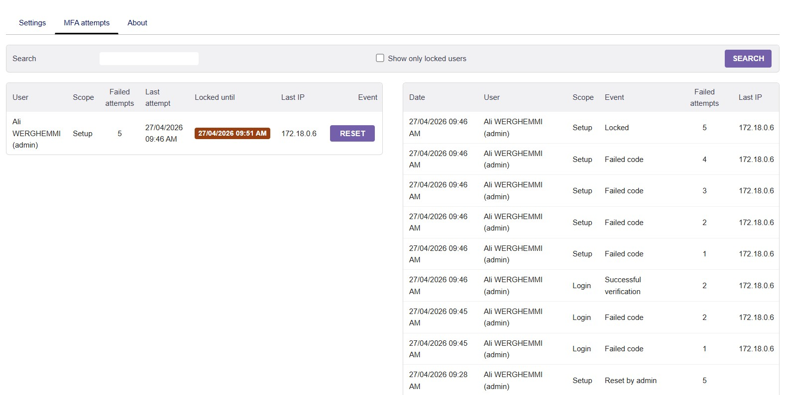

# MFA FOR [DOLIBARR ERP & CRM](https://www.dolibarr.org)

Multi-Factor Authentication module for Dolibarr using TOTP-compatible authenticator applications such as Google Authenticator, Microsoft Authenticator, Authy, or FreeOTP.

## Screenshots

- user card with `Setup MFA`, QR code, secret, and verification field




- login page showing the MFA code prompt




- admin page with MFA failed-attempt history and reset actions




## Overview

This module adds a second authentication step after the standard Dolibarr password check.
When MFA is enabled for a user:

- the user enters the usual Dolibarr login and password
- Dolibarr asks for a 6-digit TOTP code
- access is granted only after the OTP code is validated

The module also provides:

- MFA enrollment from the Dolibarr user card
- QR code provisioning for authenticator apps
- enable and disable actions for each user
- failed-attempt tracking for both login and setup verification
- an admin-only history page to review lockouts and reset blocked users

## Features

- TOTP secret generation compatible with standard authenticator apps
- QR code provisioning URI for quick enrollment
- MFA challenge on login for users with MFA enabled
- User-card interface to enroll and activate MFA
- Admin interface for MFA attempt history and lock reset
- CSRF-protected setup and state-change actions
- Lockout handling after repeated invalid MFA codes

## Installation

Prerequisite: Dolibarr ERP & CRM must already be installed.

For project inquiries or deployment assistance:

- Contact: [contact@concorde.tn](mailto:contact@concorde.tn)
- Developer: [ali.werghemmi@concorde.tn](mailto:ali.werghemmi@concorde.tn)
- Website: [https://www.concorde.tn](https://www.concorde.tn)

### From a ZIP package

If you have a packaged archive such as `module_mfa-1.0.zip`:

1. Log in to Dolibarr as a super-administrator.
2. Go to `Home > Setup > Modules/Applications > Deploy/Install external module`.
3. Upload the archive.
4. Enable the `MFA` module from the modules list.

### Manual installation

Copy the `mfa` directory into your Dolibarr custom modules directory:

```bash
htdocs/custom/mfa
```

Then:

1. Log in to Dolibarr as a super-administrator.
2. Open `Home > Setup > Modules/Applications`.
3. Enable the `MFA` module.
4. If you are upgrading an existing installation, run the module update so the MFA attempt history tables are created.

## Usage

### Enroll a user

1. Open the user card of the target user.
2. Click `Setup MFA`.
3. Scan the QR code with an authenticator application.
4. Enter the 6-digit verification code.
5. Click `Verify and Enable`.

### Login flow

1. The user enters login and password as usual.
2. If MFA is enabled, Dolibarr prompts for the authenticator code.
3. After successful verification, the user is logged in.

### Reset a locked user

1. Log in as an administrator.
2. Open the MFA admin page for attempt history.
3. Find the affected user in the current state list.
4. Click `Reset` to clear the lock or failed-attempt state.

## Attempt History

The module keeps persistent MFA failure and lock information for:

- login verification failures
- MFA setup verification failures

Administrators can review:

- current failed-attempt counters
- lock expiration times
- source IP addresses
- recent history of failure, lock, reset, and success events

## Translations

Translations can be adjusted by editing the language files under:

```text
langs/en_US/mfa.lang
langs/fr_FR/mfa.lang
langs/ar_SA/mfa.lang
```

## Ownership

Copyright (C) 2026 CONCORDE de Conseil [contact@concorde.tn](mailto:contact@concorde.tn)
Copyright (C) 2026 Ali WERGHEMMI [ali.werghemmi@concorde.tn](mailto:ali.werghemmi@concorde.tn)

Company website: [https://www.concorde.tn](https://www.concorde.tn)

## License

### Main code

GPLv3 or any later version. See [COPYING](COPYING).

### Documentation

This README and the module documentation are distributed with the module repository for project use and maintenance.
